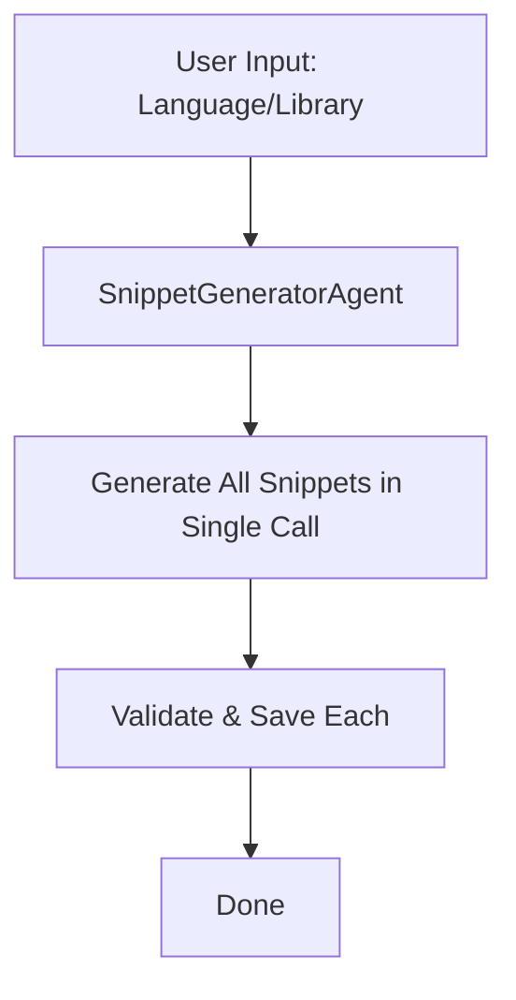

# PRD: PydanticAI Language Code Snippet Generator

## Overview

A PydanticAI-based agentic pipeline that generates code snippets for a specified programming language and/or library. The system generates 30 (configurable) snippets, one per file, with structured output and validation.

## Goals

- Generate 30 code snippets per run (configurable via config)
- Support any programming language and library
- Output each snippet as a separate file
- Ensure code quality through validation
- Provide structured metadata for each snippet

## User Stories

1. **As a developer**, I want to input a language/library name and receive 30 useful code snippets, so I can quickly bootstrap my project.
2. **As a technical writer**, I want each snippet to include a description and dependencies, so I can document them properly.
3. **As a maintainer**, I want configurable output count and output directory, so I can adapt the tool to different needs.

## Architecture



## Technical Design

### Core Components

#### 1. Configuration
```python
# config.py
SNIPPET_COUNT = 30
OUTPUT_DIR = "output/snippets"
MODEL_NAME = "openai:gpt-4o-mini"
```

#### 2. Data Models
```python
# models.py
class CodeSnippet(BaseModel):
    code: str
    language: str
    description: str
    dependencies: list[str] = []
    use_case: str
    complexity: Literal["beginner", "intermediate", "advanced"]

class SnippetCollection(BaseModel):
    snippets: list[CodeSnippet]  # All snippets in one response
```

#### 3. Agent Definition
```python
# agent.py
agent = Agent(
    MODEL_NAME,
    output_type=CodeSnippet,
    deps_type=SnippetGeneratorDeps,
)
```

#### 4. File Output Tool
```python
# tools.py
@agent.tool
def save_snippet(ctx: RunContext, snippet: CodeSnippet, index: int) -> str:
    """Save snippet to file and return filepath."""
    ...
```

## Implementation Plan

- [x] Create configuration module with snippet count and output directory
- [x] Define Pydantic models for snippet structure
- [x] Implement SnippetGeneratorAgent with system prompt
- [x] Create file output tool for saving snippets
- [x] Build main orchestration loop to generate N snippets
- [x] Add validation for generated code (syntax check)
- [x] Implement error handling and retry logic
- [x] Add CLI interface for user input

## File Structure

```
src/snippet_generator/
├── __init__.py         # Package exports
├── config.py           # Configuration settings
├── models.py           # Pydantic models
├── agent.py            # Agent definition
├── tools.py            # File output tools
├── main.py             # Entry point
├── validators.py       # Code validation utilities
└── requirements.txt    # Python dependencies
```

## Configuration

| Parameter | Default | Description |
|-----------|---------|-------------|
| `SNIPPET_COUNT` | 30 | Number of snippets to generate |
| `OUTPUT_DIR` | `output/snippets` | Directory for output files |
| `MODEL_NAME` | `openai:gpt-4o-mini` | LLM model to use |
| `VALIDATE_SYNTAX` | `true` | Whether to validate code syntax |

## Output Format

Each snippet saved as `snippet_{index:02d}_{language}.{ext}`:
```
output/snippets/
├── snippet_01_python.py
├── snippet_02_python.py
└── ...
```

## Validation Strategy

- Syntax validation using language-specific parsers
- Dependency list verification
- Complexity level consistency check

## Future Enhancements

- RAG integration for library-specific patterns
- Multi-agent approach for different complexity levels
- Template-based generation for common patterns
- Integration with LangGraph for complex workflows

## Implementation Status

All components have been implemented in `src/snippet_generator/`:

| File | Description |
|------|-------------|
| [`config.py`](src/snippet_generator/config.py) | Configuration with SNIPPET_COUNT=30, OUTPUT_DIR, MODEL_NAME |
| [`models.py`](src/snippet_generator/models.py) | CodeSnippet, SnippetCollection, and SnippetGeneratorDeps models |
| [`validators.py`](src/snippet_generator/validators.py) | Python and JavaScript syntax validation |
| [`tools.py`](src/snippet_generator/tools.py) | File saving with header comments and validation |
| [`agent.py`](src/snippet_generator/agent.py) | PydanticAI agent with output_type=SnippetCollection |
| [`main.py`](src/snippet_generator/main.py) | CLI entry point - single call generates all snippets |
| [`__init__.py`](src/snippet_generator/__init__.py) | Package exports |

## Usage

```bash
# Set OpenAI API key (required)
export OPENAI_API_KEY="your-api-key"

# Generate 30 Python snippets
python -m src.snippet_generator.main --language python

# Generate 10 JavaScript snippets with React
python -m src.snippet_generator.main --language javascript --library react --count 10

# Generate snippets with custom tuning
python -m src.snippet_generator.main --language python --tune-prompt "focus on data processing patterns"
```

## Requirements

Install dependencies:
```bash
pip install -r src/snippet_generator/requirements.txt
```

**Note:** Requires `OPENAI_API_KEY` environment variable to be set for the OpenAI model.

## Single-Call Generation

All snippets are generated in a **single LLM call** with the `SnippetCollection` output type. The agent receives:
- Total count of snippets to generate
- Language and optional library
- Complexity distribution guidance (40% beginner, 40% intermediate, 20% advanced)
- Optional tune-prompt for customization

This ensures variety and efficiency - the LLM generates all snippets at once with different use cases and complexity levels.

## CLI Arguments

| Argument | Short | Required | Default | Description |
|----------|-------|----------|---------|-------------|
| `--language` | `-l` | Yes | - | Programming language |
| `--library` | `-lib` | No | "" | Library/framework to use |
| `--count` | `-c` | No | 30 | Number of snippets |
| `--tune-prompt` | `-t` | No | "" | Additional prompt to fine-tune generation |
